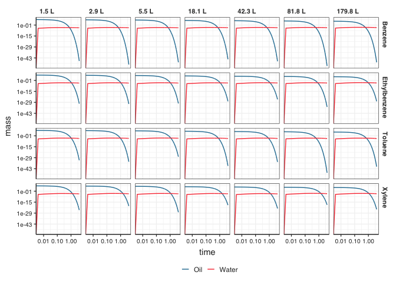

# Required packages


```r
library(tidyverse)
```

```
## ── Attaching packages ─────────────────────────────────────────────────────────────────────────────────── tidyverse 1.3.0 ──
```

```
## ✓ ggplot2 3.3.2     ✓ purrr   0.3.4
## ✓ tibble  3.0.3     ✓ dplyr   1.0.2
## ✓ tidyr   1.1.2     ✓ stringr 1.4.0
## ✓ readr   1.3.1     ✓ forcats 0.5.0
```

```
## ── Conflicts ────────────────────────────────────────────────────────────────────────────────────── tidyverse_conflicts() ──
## x dplyr::filter() masks stats::filter()
## x dplyr::lag()    masks stats::lag()
```

```r
library(lubridate)
```

```
## 
## Attaching package: 'lubridate'
```

```
## The following objects are masked from 'package:base':
## 
##     date, intersect, setdiff, union
```

```r
library(janitor)
```

```
## 
## Attaching package: 'janitor'
```

```
## The following objects are masked from 'package:stats':
## 
##     chisq.test, fisher.test
```

```r
library(patchwork)
library(scales)
```

```
## 
## Attaching package: 'scales'
```

```
## The following object is masked from 'package:purrr':
## 
##     discard
```

```
## The following object is masked from 'package:readr':
## 
##     col_factor
```

```r
library(broom)
library(here)
```

```
## here() starts at /Users/Pepe/Dropbox/Postdoc/02_Ottawa/000_Manuscripts/008_BETEX/BETEX_fate_model
```

```r
library(gt)

library(deSolve)
```

# Formating

Loading and setting BOREAL ggplot theme an BOREAL colour palettes


```r
source(here("functions", "theme_boreal.R"))     # Loads the BOREAL ggplot theme
source(here("functions", "boreal_colours.R"))   # Loads the BOREAL themed palettes and ggplot scales

theme_set(theme_boreal())  #Sets the theme for all ggplot plots to the BOREAL theme in this script
```

# Load data

set the time interval you want to run the model over. I went with length.out instead of the steps, because this way i can get more datapoints, which makes for a smoother line.


```r
time <- seq(0, 4, length.out = 1000) 
```

Load the treatment data so we can have enclosure volumes and mas/volume of oil applied (volumes up to date as of Feb, 15th 2021). I usually would do it in a separate step, but making the treatment column an ordered factor here as well.


```r
treatments <- read_csv(here("data_raw", "treatments_with_volumes.csv")) %>% 
      mutate(treatment = factor(treatment, levels = c("NFC", "FFC", "1.5 L", "2.9 L", "5.5 L", "18.1 L", "42.3 L", "81.8 L","179.8 L"))) 
```

```
## Parsed with column specification:
## cols(
##   enclosure = col_character(),
##   nominal_oil_l = col_double(),
##   poured_oil_kg = col_double(),
##   poured_oil_l = col_double(),
##   center_depth_sandbag_day_cm = col_double(),
##   applied_date = col_character(),
##   applied_time = col_time(format = ""),
##   applied_date_time = col_character(),
##   initial_enc_volume = col_double(),
##   intensive = col_character(),
##   limnocorral = col_character(),
##   final_dilution_1_in = col_double(),
##   nominal_dilution_1_in = col_double(),
##   treatment = col_character()
## )
```

```r
treatments
```

```
## # A tibble: 9 x 14
##   enclosure nominal_oil_l poured_oil_kg poured_oil_l center_depth_sa…
##   <chr>             <dbl>         <dbl>        <dbl>            <dbl>
## 1 M1               160           166.         180.                138
## 2 M2                 7.43          5.09         5.51              148
## 3 M3                34.5          39.1         42.3               167
## 4 M4                 0             0            0                 168
## 5 M5                 3.45          2.65         2.87              157
## 6 M6                 1.6           1.34         1.45              156
## 7 M7                16            16.7         18.1               187
## 8 M8                74.3          75.5         81.8               173
## 9 M9                 0             0            0                 152
## # … with 9 more variables: applied_date <chr>, applied_time <time>,
## #   applied_date_time <chr>, initial_enc_volume <dbl>, intensive <chr>,
## #   limnocorral <chr>, final_dilution_1_in <dbl>, nominal_dilution_1_in <dbl>,
## #   treatment <fct>
```

The following file contains all partitioning coefficients as well as starting concentrations. I am not sure if you'd get this from somewhere else or you'll make it by hand, but just save it as a csv and load it here. One set of constants per compound and enclosure.

This is mock data with rates taken randomly from a few normal distributions. The script to create it is in the `r` folder. Obviously, use your data.


```r
btex_parameters <- read_csv(here("data_raw", "btex_parameters.csv"))
```

```
## Parsed with column specification:
## cols(
##   enclosure = col_character(),
##   compound = col_character(),
##   kot = col_double(),
##   kow = col_double(),
##   kwt = col_double()
## )
```

```r
btex_parameters
```

```
## # A tibble: 28 x 5
##    enclosure compound   kot   kow   kwt
##    <chr>     <chr>    <dbl> <dbl> <dbl>
##  1 M1        Benzene   30.2 0.246 0.216
##  2 M2        Benzene   31.1 0.142 0.230
##  3 M3        Benzene   29.8 0.213 0.246
##  4 M5        Benzene   32.9 0.177 0.202
##  5 M6        Benzene   30.5 0.140 0.187
##  6 M7        Benzene   28.6 0.200 0.195
##  7 M8        Benzene   33.1 0.213 0.223
##  8 M1        Toluene   25.5 0.207 0.267
##  9 M2        Toluene   19.0 0.236 0.193
## 10 M3        Toluene   22.4 0.241 0.279
## # … with 18 more rows
```
Initial BTEX data. I am going with whith what you had. One value for compound (concentration in source oil?) if you have data for each enclosure, just make a table with the values per enclosure/compound. The `left_join()` later on wil take care of the merge (as long as variable names are the same)


```r
btex_initial <- read_csv(here("data_raw", "btex_initial.csv"))
```

```
## Parsed with column specification:
## cols(
##   compound = col_character(),
##   oil = col_double(),
##   water = col_double()
## )
```

```r
btex_initial
```

```
## # A tibble: 4 x 3
##   compound       oil water
##   <chr>        <dbl> <dbl>
## 1 Benzene       1465     0
## 2 Toluene       1200     0
## 3 Ethylbenzene  1000     0
## 4 Xylene         900     0
```
# Data processing

We are going to create a nested tible (virtualy a list), where we will store the individual datasets for each compound/enclosure combinations as their own cells. We include the time here as well, as the `ode()` function was being silly and didnt like looking for it outside when run inside of `pmap()`


```r
data <- btex_parameters %>%  
  group_by(compound, enclosure) %>% 
  nest() %>% 
  rename(parameters = data) %>% 
  left_join(btex_initial %>%  
              group_by(compound) %>% 
              nest() %>% 
              rename(initial = data)) %>% 
  mutate(time = list(time))
```

```
## Joining, by = "compound"
```

```r
data
```

```
## # A tibble: 28 x 5
## # Groups:   enclosure, compound [28]
##    enclosure compound parameters       initial          time         
##    <chr>     <chr>    <list>           <list>           <list>       
##  1 M1        Benzene  <tibble [1 × 3]> <tibble [1 × 2]> <dbl [1,000]>
##  2 M2        Benzene  <tibble [1 × 3]> <tibble [1 × 2]> <dbl [1,000]>
##  3 M3        Benzene  <tibble [1 × 3]> <tibble [1 × 2]> <dbl [1,000]>
##  4 M5        Benzene  <tibble [1 × 3]> <tibble [1 × 2]> <dbl [1,000]>
##  5 M6        Benzene  <tibble [1 × 3]> <tibble [1 × 2]> <dbl [1,000]>
##  6 M7        Benzene  <tibble [1 × 3]> <tibble [1 × 2]> <dbl [1,000]>
##  7 M8        Benzene  <tibble [1 × 3]> <tibble [1 × 2]> <dbl [1,000]>
##  8 M1        Toluene  <tibble [1 × 3]> <tibble [1 × 2]> <dbl [1,000]>
##  9 M2        Toluene  <tibble [1 × 3]> <tibble [1 × 2]> <dbl [1,000]>
## 10 M3        Toluene  <tibble [1 × 3]> <tibble [1 × 2]> <dbl [1,000]>
## # … with 18 more rows
```

# functions

Now we define the R function to calculate the value of the derivatives at each time value. Make sure to use the names of the variables as defined in the vectors above. (For more info, check [here](https://cran.r-project.org/web/packages/deSolve/vignettes/deSolve.pdf))


```r
oil_water_function <- function(t, initial, parameters){
  with(as.list(c(initial, parameters)), {
    dO = -kot * oil
    dW = kow * oil - kwt * water
    return(list(c(dO, dW)))
  })
}
```

# Model integration

Now that we have a large dataset where we have the individual datasets for parameters and initial values for each compound/enclosure combination, we can just use `pmap()` to run the `ode()` on each set. Here we also transform it into a tibble, but i had to go through a data.frame first because there was some atribute embedded in the output format of the ode() that made tibble trip.


```r
results <- data %>% 
  mutate(output = pmap(list(parameters, initial, time),
                       ~ ode(y = unlist(..2), times = ..3, func = oil_water_function, parms = unlist(..1)) %>% 
                         as.data.frame %>% 
                         as_tibble))

results
```

```
## # A tibble: 28 x 6
## # Groups:   enclosure, compound [28]
##    enclosure compound parameters      initial        time       output          
##    <chr>     <chr>    <list>          <list>         <list>     <list>          
##  1 M1        Benzene  <tibble [1 × 3… <tibble [1 × … <dbl [1,0… <tibble [1,000 …
##  2 M2        Benzene  <tibble [1 × 3… <tibble [1 × … <dbl [1,0… <tibble [1,000 …
##  3 M3        Benzene  <tibble [1 × 3… <tibble [1 × … <dbl [1,0… <tibble [1,000 …
##  4 M5        Benzene  <tibble [1 × 3… <tibble [1 × … <dbl [1,0… <tibble [1,000 …
##  5 M6        Benzene  <tibble [1 × 3… <tibble [1 × … <dbl [1,0… <tibble [1,000 …
##  6 M7        Benzene  <tibble [1 × 3… <tibble [1 × … <dbl [1,0… <tibble [1,000 …
##  7 M8        Benzene  <tibble [1 × 3… <tibble [1 × … <dbl [1,0… <tibble [1,000 …
##  8 M1        Toluene  <tibble [1 × 3… <tibble [1 × … <dbl [1,0… <tibble [1,000 …
##  9 M2        Toluene  <tibble [1 × 3… <tibble [1 × … <dbl [1,0… <tibble [1,000 …
## 10 M3        Toluene  <tibble [1 × 3… <tibble [1 × … <dbl [1,0… <tibble [1,000 …
## # … with 18 more rows
```

You can check the output of one of them 


```r
results$output[[1]]
```

```
## # A tibble: 1,000 x 3
##       time   oil water
##      <dbl> <dbl> <dbl>
##  1 0       1465   0   
##  2 0.00400 1298.  1.36
##  3 0.00801 1150.  2.56
##  4 0.0120  1019.  3.63
##  5 0.0160   903.  4.57
##  6 0.0200   800.  5.40
##  7 0.0240   708.  6.14
##  8 0.0280   628.  6.79
##  9 0.0320   556.  7.37
## 10 0.0360   493.  7.87
## # … with 990 more rows
```
Now we un-nest it to make it easy to use inn ggplot (unless you want to make individual plots, in qich case you might want to keep nested and use `pmap()` again, but in this case to creat the plots)


```r
results_unnested <- results %>% 
  select(-parameters, -initial, -time) %>% 
  unnest(cols = c(output))


results_unnested
```

```
## # A tibble: 28,000 x 5
## # Groups:   enclosure, compound [28]
##    enclosure compound    time   oil water
##    <chr>     <chr>      <dbl> <dbl> <dbl>
##  1 M1        Benzene  0       1465   0   
##  2 M1        Benzene  0.00400 1298.  1.36
##  3 M1        Benzene  0.00801 1150.  2.56
##  4 M1        Benzene  0.0120  1019.  3.63
##  5 M1        Benzene  0.0160   903.  4.57
##  6 M1        Benzene  0.0200   800.  5.40
##  7 M1        Benzene  0.0240   708.  6.14
##  8 M1        Benzene  0.0280   628.  6.79
##  9 M1        Benzene  0.0320   556.  7.37
## 10 M1        Benzene  0.0360   493.  7.87
## # … with 27,990 more rows
```

Now we add the treatment dataset to convert to massess based on oil and enclosure volumes (this part i am not sure if it is what you wanted, if not, let me know!!)


```r
results_long <- results_unnested %>% 
  left_join(treatments) %>% 
  mutate(mass_in_oil = oil / (poured_oil_l/1000),
         mass_in_water = water / initial_enc_volume) %>% 
  ungroup() %>% 
  select(compound, enclosure, treatment, mass_in_oil, mass_in_water, time) %>% 
  rename(Oil = mass_in_oil,
         Water = mass_in_water) %>% 
  pivot_longer(cols = c(Oil, Water), names_to = "compartment", values_to = "mass")
```

```
## Joining, by = "enclosure"
```

```r
results_long
```

```
## # A tibble: 56,000 x 6
##    compound enclosure treatment    time compartment         mass
##    <chr>    <chr>     <fct>       <dbl> <chr>              <dbl>
##  1 Benzene  M1        179.8 L   0       Oil         8149.       
##  2 Benzene  M1        179.8 L   0       Water          0        
##  3 Benzene  M1        179.8 L   0.00400 Oil         7219.       
##  4 Benzene  M1        179.8 L   0.00400 Water          0.0000150
##  5 Benzene  M1        179.8 L   0.00801 Oil         6396.       
##  6 Benzene  M1        179.8 L   0.00801 Water          0.0000282
##  7 Benzene  M1        179.8 L   0.0120  Oil         5666.       
##  8 Benzene  M1        179.8 L   0.0120  Water          0.0000400
##  9 Benzene  M1        179.8 L   0.0160  Oil         5020.       
## 10 Benzene  M1        179.8 L   0.0160  Water          0.0000503
## # … with 55,990 more rows
```


```r
results_plot <- results_long %>% 
  ggplot() +
  facet_grid(rows = vars(compound), cols = vars(treatment)) +
  geom_line(aes(x = time, y = mass, col = compartment)) +
  scale_colour_boreal() +
  scale_x_log10() +
  scale_y_log10() +
  theme(legend.position = "bottom")
  

ggsave(here("figures", "BTEX_model_output.pdf"), results_plot,
         width = 190, height = 140, units = "mm")
```

```
## Warning: Transformation introduced infinite values in continuous x-axis
```

```
## Warning: Transformation introduced infinite values in continuous y-axis
```

```r
results_plot
```

```
## Warning: Transformation introduced infinite values in continuous x-axis

## Warning: Transformation introduced infinite values in continuous y-axis
```

<!-- -->


